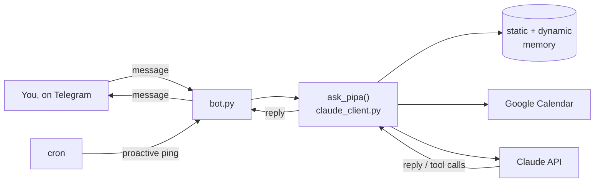

<div align="center">

# 🤖 PiPA

A **P**ersonal **A**ssistant for your Raspberry **Pi** - a Telegram bot that knows your calendar and nudges you at the moments that actually matter in your day.

[](LICENSE)
[](https://www.python.org/)
[](https://www.anthropic.com/)
[](https://core.telegram.org/bots)
[](https://www.raspberrypi.com/)

</div>

---

PiPA is a **single-user** personal-assistant template: one bot, one owner, one Telegram chat. Talk to it like a coach who already knows your calendar, your goals, and how your day tends to go off the rails - and have it check in on you proactively, not just when you message it first.

> [!NOTE]
> This is a template, not a hosted service. You bring your own Telegram bot token, Anthropic API key, and Google Calendar - see [Quick start](#-quick-start).

## Contents

- [Features](#-features)
- [How it works](#-how-it-works)
- [Quick start](#-quick-start)
- [Configuration](#️-configuration)
- [Proactive pings](#-proactive-pings)
- [Project structure](#-project-structure)
- [Security](#-security)
- [License](#-license)

## ✨ Features

| | |
|---|---|
| 💬 **Two-way chat** | Message the bot on Telegram, it replies using the Claude API - no dashboard, no app, just chat. |
| 📅 **Calendar tools** | The model can read today's calendar and create, update, or delete events for you, with explicit success/failure verification before it ever tells you something was done. |
| 🧠 **Two-tier memory** | `static_memory.md` holds your goals, schedule, and rules (you edit it); `dynamic_memory.md` is a rolling 3-day log the bot appends to automatically and prunes on startup. |
| ⏰ **Proactive pings** | Cron-triggered check-ins tied to your daily rhythm - morning, pre-focus-block, post-break, evening, end-of-day. Fully rewritable. |
| 🛠️ **No infra** | No database, no server framework, no build step. A handful of Python files and a systemd unit. |

## 🔍 How it works



Every call builds one context block - the live calendar, your static memory, your recent dynamic memory, and either your message or the current ping's instructions - then runs a Claude tool-use loop (capped at 10 iterations) until it has a final reply. Calendar writes go through `create_event` / `update_event` / `delete_event` tools that return an explicit `SUCCESS`/`FAILED` string, and the system prompt requires the model to check that before ever confirming an action to you.

See [ARCHITECTURE.md](ARCHITECTURE.md) for the full architecture walkthrough.

## 🚀 Quick start

```bash
pip3 install anthropic python-telegram-bot google-auth google-auth-oauthlib google-api-python-client --break-system-packages

cp credentials/.env.example credentials/.env    # fill in TELEGRAM_TOKEN, TELEGRAM_CHAT_ID, ANTHROPIC_API_KEY

# Download an OAuth client secret from Google Cloud Console (Desktop app,
# Calendar API enabled), save it as credentials/credentials.json - see credentials/credentials.json.example

python3 scripts/oauth_setup.py  # one-time interactive Google Calendar auth
python3 src/bot.py              # start the listener
```

For the systemd service and cron setup (so it survives reboots and pings you on schedule), see [docs/SETUP.md](docs/SETUP.md).

## ⚙️ Configuration

Everything below is an environment variable - set them in `credentials/.env` (see `credentials/.env.example`).

| Variable | Default | Description |
|---|---|---|
| `TELEGRAM_TOKEN` | - | Your Telegram bot token, from [@BotFather](https://t.me/BotFather) |
| `TELEGRAM_CHAT_ID` | - | The one chat ID PiPA is allowed to talk in |
| `ANTHROPIC_API_KEY` | - | Your Anthropic API key |
| `BOT_NAME` | `PiPA` | What the bot calls itself in its own replies |
| `TIMEZONE` | `UTC` | IANA timezone, e.g. `America/New_York`, `Asia/Kolkata` |

Beyond env vars, two files shape the bot's personality and knowledge:

| File | What it's for |
|---|---|
| `memory/static_memory.md` | Your goals, schedule anchors, rules, known failure modes - injected into every conversation. **This is the main file to fill in.** |
| `src/prompts.py` | The bot's persona and each proactive ping's wording. Rename, add, or remove pings freely - `bot.py` derives valid `--ping` values straight from this file. |

## ⏰ Proactive pings

Ships with six example checkpoints, each meant to land at a real transition point in your day. Times are illustrative - wire them up to your own routine via `crontab -e` (see [docs/SETUP.md](docs/SETUP.md)).

| Ping | Moment | What it does |
|---|---|---|
| `morning` | Start of day | Day + date, sleep check, key calendar blocks, energy check |
| `midday` | Mid-morning | Quick focus/drift check, flags anything time-sensitive soon |
| `pre_focus` | Before a focus/study block | Heads-up + a lighter fallback mode if energy is low |
| `post_break` | After a nap/gym/walk | Re-ignition nudge toward the next high-value block |
| `evening` | Wind-down | Honest one-line read of the day, no pep talk |
| `eod` | End of day | Closing-routine reminder, grounding sign-off |

```bash
python3 src/bot.py --ping morning
```

## 📁 Project structure

```
.
├── src/
│   ├── bot.py                 # Telegram entry point (listener + --ping CLI)
│   ├── claude_client.py       # Context builder, Claude tool-use loop, calendar tools
│   ├── memory.py              # Read/append/prune the two memory files
│   ├── prompts.py             # System prompt + per-ping instructions
│   └── config.py              # Env-var driven settings
├── scripts/
│   └── oauth_setup.py         # One-time Google Calendar OAuth flow
├── systemd/
│   └── pipa.service           # systemd unit template
├── docs/
│   └── SETUP.md               # Full setup walkthrough
├── credentials/
│   ├── .env.example           # Secrets template
│   └── credentials.json.example  # Google OAuth client secret template
└── memory/
    ├── static_memory.md       # Your goals/schedule/rules (template)
    └── dynamic_memory.md      # Rolling log, gitignored once populated
```

## 🔒 Security

`credentials/.env`, `credentials/credentials.json`, and `credentials/token.json` hold live secrets once configured (Telegram token, Anthropic API key, Google OAuth client secret, and a refreshable OAuth token). They're gitignored - **never commit them**. Use `credentials/.env.example` and `credentials/credentials.json.example` as your starting points.

## 📄 License

MIT - see [LICENSE](LICENSE).
